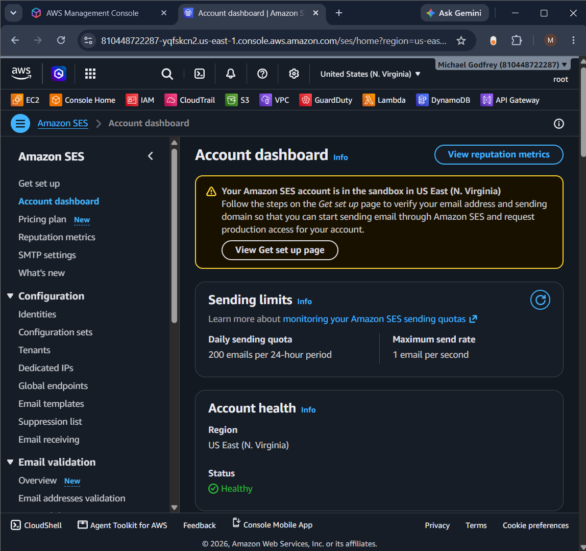

# 🚀 Serverless Contact Form on AWS

A fully serverless contact form application built using Amazon Web Services (AWS). This project demonstrates how multiple AWS managed services can be integrated to build a secure, scalable, and cost-effective web application without provisioning or managing traditional servers.

The application enables users to submit messages through a contact form hosted on Amazon S3. Whenever a user submits the form, the request is forwarded to Amazon API Gateway, which invokes an AWS Lambda function. The Lambda function validates the submitted information, stores it in Amazon DynamoDB, and sends an email notification using Amazon Simple Email Service (SES). Finally, the application returns a response to the website informing the user whether the submission was successful.

By adopting a serverless architecture, the application automatically scales based on incoming requests while reducing infrastructure management and operational costs.

---

# 📖 Project Overview

This project demonstrates the implementation of a complete serverless web application using AWS managed services. Instead of deploying and maintaining traditional web servers, databases, and email servers, the solution relies entirely on managed AWS services to process requests, store data, and send notifications.

The application follows an event-driven architecture where each AWS service performs a dedicated task. Amazon S3 hosts the frontend, Amazon API Gateway receives incoming requests, AWS Lambda processes business logic, Amazon DynamoDB stores user submissions, and Amazon SES sends email notifications.

---

# 🎯 Project Purpose

The purpose of this project is to build a fully functional serverless contact form capable of securely receiving user messages, storing them in a cloud database, and automatically notifying the administrator through email.

---

# 🎯 Project Objectives

- Design and deploy a serverless web application using AWS.
- Host a static website using Amazon S3.
- Create a REST API using Amazon API Gateway.
- Develop a backend using AWS Lambda and Python.
- Validate user input before processing requests.
- Store contact form submissions securely in Amazon DynamoDB.
- Send automated email notifications using Amazon SES.
- Implement secure communication using IAM.

---

# 🏗️ Project Architecture

```text
                    User
                      │
                      ▼
          Amazon S3 Static Website
                      │
                      ▼
        Amazon API Gateway (REST API)
                      │
                      ▼
            AWS Lambda (Python)
         ┌────────────┴────────────┐
         ▼                         ▼
 Amazon DynamoDB             Amazon SES
(Store Submission)      (Send Email Notification)
```

## Architecture Explanation

The serverless contact form follows an event-driven architecture where each AWS service performs a specific role in processing user requests. Instead of relying on traditional web servers, the application uses managed AWS services that automatically scale based on demand.

The workflow begins when a user opens the contact form hosted on **Amazon S3**. Since the website consists of static files such as HTML, CSS, and JavaScript, Amazon S3 serves these files directly to the user's browser.

When the user completes the form and clicks **Submit**, the frontend sends an HTTP **POST** request to **Amazon API Gateway**. API Gateway acts as the communication layer between the frontend and the backend by exposing a REST API endpoint that securely receives incoming requests.

API Gateway then invokes the **AWS Lambda** function. Lambda executes the Python code responsible for validating the submitted data, processing the request, generating a unique `submission_id`, and coordinating the remaining backend tasks.

After successful validation, the Lambda function stores the contact form details in **Amazon DynamoDB**, ensuring every submission is permanently saved in a fully managed NoSQL database.

Next, Lambda communicates with **Amazon Simple Email Service (SES)** to automatically send an email notification containing the submitted information to the configured recipient.

Finally, Lambda returns a JSON response to API Gateway, which forwards the response back to the frontend application. The website then displays a confirmation message indicating that the contact form has been submitted successfully.

This architecture provides a scalable, reliable, and cost-effective solution while eliminating the need to manage traditional servers.

---

# ☁️ AWS Services Used

## Amazon S3 (Simple Storage Service)

Amazon S3 was used to host the frontend as a static website. After creating the bucket, Static Website Hosting was enabled and the website files (HTML, CSS, JavaScript and assets) were uploaded.

The screenshot below shows the S3 bucket configured for Static Website Hosting.


---

## Amazon API Gateway

Amazon API Gateway was used to expose the backend through a REST API.

### Creating the REST API

A Regional REST API named **ContactFormAPI** was created. This API acts as the entry point for requests coming from the website.


### Creating the POST Method

A POST method was added to the `/contact` resource. This method receives the contact form submission and forwards it to AWS Lambda using Lambda Proxy Integration.


### Lambda Integration

The screenshot below shows the successful integration between API Gateway and the Lambda function.


---

## AWS Lambda

AWS Lambda serves as the backend of the application.

### Creating the Lambda Function

A Lambda function was created using the Python runtime. It executes automatically whenever API Gateway receives a POST request.


### Lambda Execution Role

The execution role determines which AWS services the Lambda function can access.


### IAM Permissions

Additional IAM policies were attached to allow the function to access DynamoDB and Amazon SES.


### Deploying the Lambda Function

After implementing the Python code, the function was deployed so the latest version became available for execution.


### Testing the Lambda Function

A test event was created to verify that the Lambda function executed successfully and returned the expected response before connecting it to the frontend.


---

## Amazon DynamoDB

Amazon DynamoDB stores every contact form submission.

Each submission is stored as a unique item in the `ContactFormSubmissions` table using `submission_id` as the partition key.

The screenshot below shows the DynamoDB table used by the application.


---

## Amazon Simple Email Service (SES)

Amazon SES sends an email notification whenever a contact form is successfully submitted.

Before emails could be sent, the sender email address was verified in Amazon SES. After verification, the Lambda function was able to generate and send notification emails automatically.



---

## AWS Identity and Access Management (IAM)

IAM was used to manage permissions securely between AWS services.

The Lambda execution role was granted permission to:
- Access Amazon DynamoDB.
- Send email notifications using Amazon SES.

This ensures the application follows the principle of least privilege while allowing the backend to perform its required tasks.
