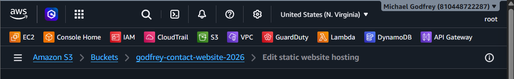
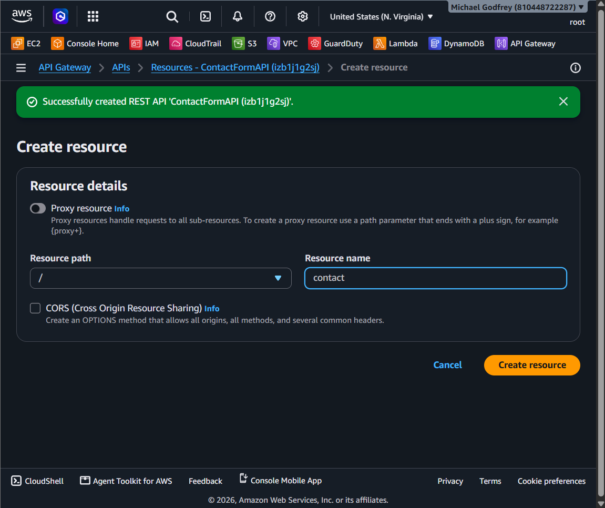
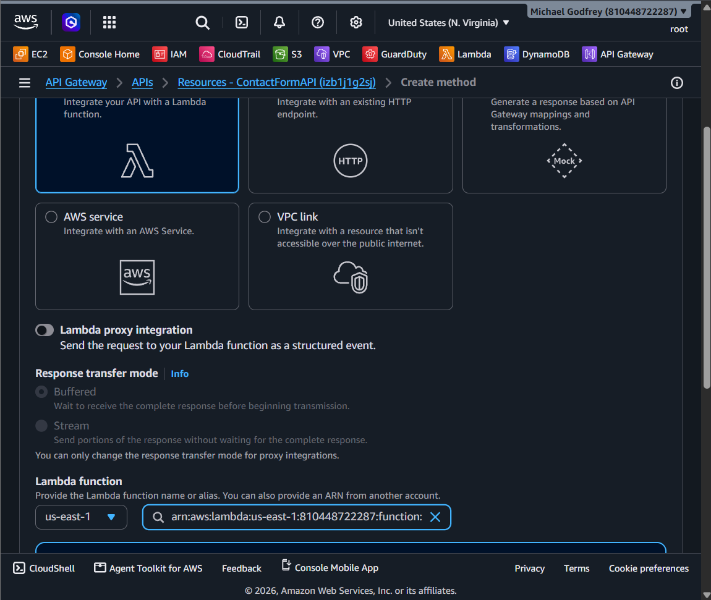
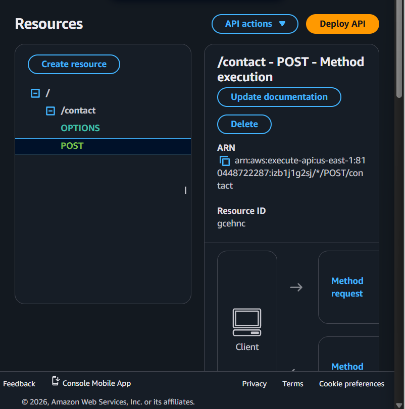
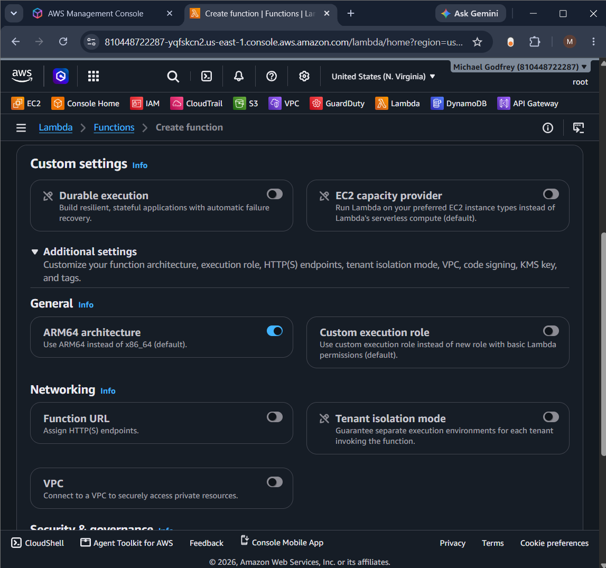
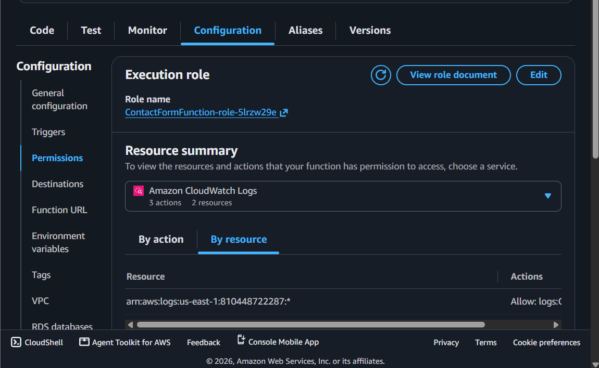
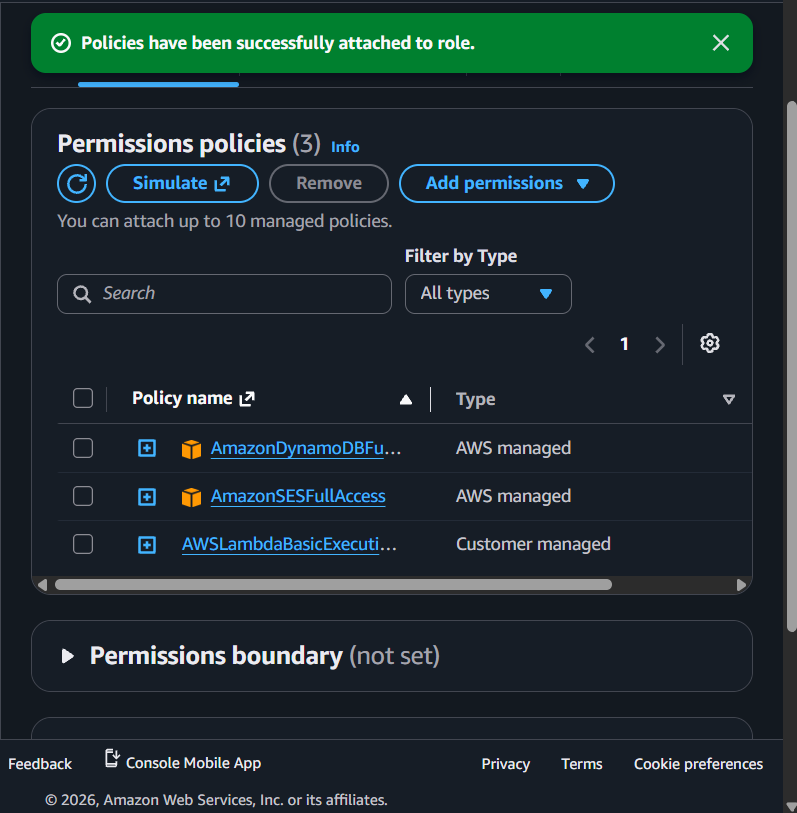
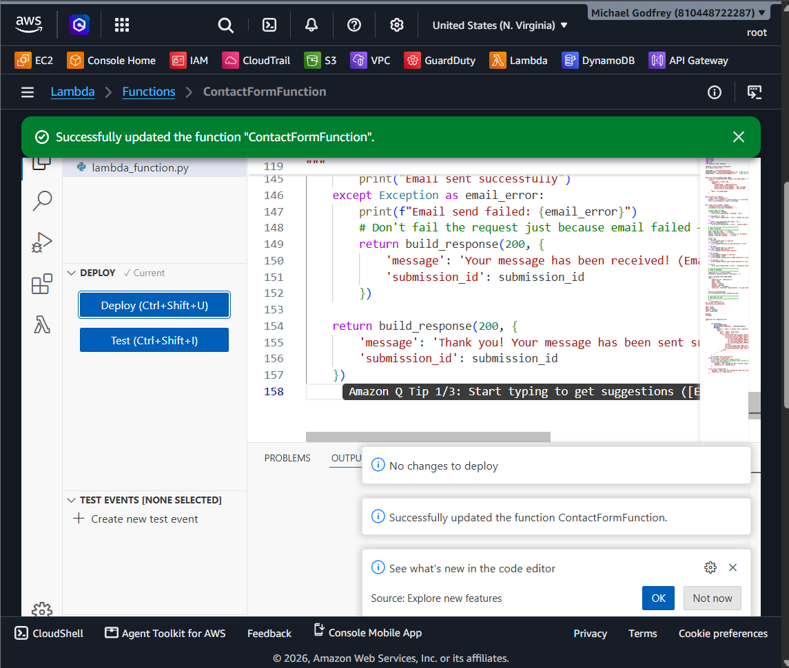
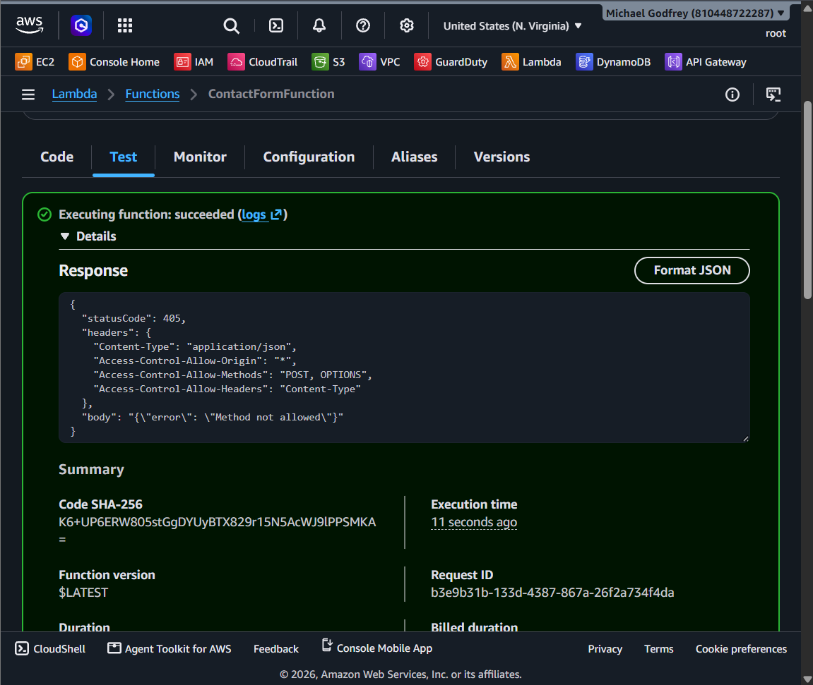
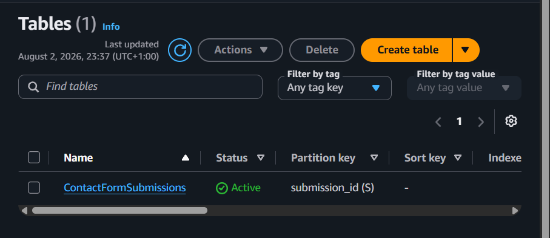

# 🚀 Serverless Contact Form on AWS

A fully serverless contact form application built using Amazon Web Services (AWS). This project demonstrates how multiple AWS managed services can be integrated to build a secure, scalable, and cost-effective web application without provisioning or managing traditional servers.

The application enables users to submit messages through a contact form hosted on Amazon S3. Whenever a user submits the form, the request is forwarded to Amazon API Gateway, which invokes an AWS Lambda function. The Lambda function validates the submitted information, stores it in Amazon DynamoDB, and sends an email notification using Amazon Simple Email Service (SES). Finally, the application returns a response to the website informing the user whether the submission was successful.

By adopting a serverless architecture, the application automatically scales based on incoming requests while reducing infrastructure management and operational costs. Every AWS service used within the project performs a specific responsibility, allowing the entire application to operate efficiently without the need for dedicated web servers.

---

# 📖 Project Overview

The purpose of this project was to design and implement a complete serverless contact form application using AWS managed services. Instead of deploying and maintaining traditional backend servers, databases, and mail servers, this solution relies entirely on AWS services to process user requests.

The project demonstrates how cloud-native applications can be developed using event-driven architecture. The frontend is hosted as a static website using Amazon S3, while API Gateway provides the communication layer between the website and the backend. AWS Lambda performs all backend processing, DynamoDB stores submitted information, and Amazon SES delivers email notifications whenever a new contact form is received.

This project also demonstrates how different AWS services can communicate securely through IAM roles and permissions while providing a highly available and scalable solution.

---

# 🎯 Project Purpose

The primary purpose of this project is to build a fully functional serverless contact form capable of receiving user messages, processing the submitted information, storing it securely, and automatically notifying the administrator via email.

The project also provides practical experience with modern cloud technologies and demonstrates how AWS managed services can replace traditional server-based applications.

---

# 🎯 Project Objectives

The objectives of this project are to:

- Design and deploy a serverless web application using AWS.
- Host a static website using Amazon S3.
- Create a REST API using Amazon API Gateway.
- Develop a backend using AWS Lambda and Python.
- Validate user input before processing requests.
- Store contact form submissions securely in Amazon DynamoDB.
- Send automated email notifications using Amazon SES.
- Implement secure access between AWS services using IAM.
- Demonstrate event-driven serverless architecture.
- Gain practical experience integrating multiple AWS services into a single application.

---

# 🏗️ Project Architecture

```text
                    User
                      │
                      ▼
          Amazon S3 Static Website
                      │
                      ▼
        Amazon API Gateway (REST API)
                      │
                      ▼
            AWS Lambda (Python)
         ┌────────────┴────────────┐
         ▼                         ▼
 Amazon DynamoDB             Amazon SES
(Store Submission)      (Send Email Notification)
```

### Architecture Explanation

The workflow begins when a user accesses the contact form hosted on Amazon S3 and submits their information.

The request is forwarded to Amazon API Gateway, which exposes a REST endpoint for the application. API Gateway validates the incoming request and invokes the AWS Lambda function.

The Lambda function executes the backend Python code responsible for validating the submitted data. Once validation is complete, the function generates a unique submission identifier and stores the information in Amazon DynamoDB.

After successfully storing the submission, AWS Lambda communicates with Amazon Simple Email Service (SES), which sends an email notification containing the submitted details to the configured recipient.

Finally, Lambda returns a JSON response through API Gateway back to the frontend, allowing the user to receive immediate confirmation that the message has been successfully submitted.

---

# ☁️ AWS Services Used

Each AWS service within this project performs a specific responsibility that contributes to the successful execution of the application.

---

## Amazon S3 (Simple Storage Service)

Amazon S3 was used to host the frontend of the application as a static website. All website assets, including the HTML, CSS, JavaScript files, and images, were uploaded to an S3 bucket.

Static Website Hosting was enabled, allowing the website to be publicly accessible through the generated S3 website endpoint.

### S3 Static Website Hosting



---

## Amazon API Gateway

Amazon API Gateway provides the communication layer between the website and the backend.

A Regional REST API named **ContactFormAPI** was created with a `/contact` resource. A POST method was configured and integrated with the Lambda function using Lambda Proxy Integration.

Whenever a user submits the contact form, API Gateway receives the HTTP request and securely forwards it to AWS Lambda for processing.

### Creating the REST API Resource



### Creating the POST Method



### Lambda Integration



---

## AWS Lambda

AWS Lambda serves as the backend of the application.

Instead of running a traditional web server, Lambda automatically executes Python code whenever a request is received from API Gateway.

The Lambda function performs several important tasks:

- Receives contact form submissions.
- Validates user input.
- Generates a unique Submission ID.
- Stores submitted information in DynamoDB.
- Sends an email notification through Amazon SES.
- Returns a JSON response back to the frontend.

Because Lambda follows a serverless execution model, there is no need to manage infrastructure or configure operating systems. AWS automatically provisions the compute resources required whenever the function is invoked.

### Creating the Lambda Function



### Lambda Execution Role



### IAM Permissions



### Deploying the Lambda Function



### Successful Lambda Test



---

## Amazon DynamoDB

Amazon DynamoDB is the database used to permanently store every contact form submission.

Each submission is stored as a separate item within the `ContactFormSubmissions` table. The table uses `submission_id` as its partition key to uniquely identify every submission.

Information stored includes:

- Submission ID
- Name
- Email Address
- Subject
- Message
- Submission Timestamp
- Source IP Address

DynamoDB was selected because it provides high performance, automatic scaling, and seamless integration with AWS Lambda.

### DynamoDB Table



---

## Amazon Simple Email Service (SES)

Amazon Simple Email Service (SES) is responsible for sending email notifications whenever a new contact form is submitted.

After the Lambda function successfully stores the submission in DynamoDB, SES automatically generates and sends an email containing the user's submitted information to the configured email address.

This allows administrators to receive immediate notification whenever a visitor submits a message through the contact form.

### Amazon SES Configuration


---

## AWS Identity and Access Management (IAM)

AWS Identity and Access Management (IAM) was used to securely control communication between AWS services.

An execution role was attached to the Lambda function with permissions to:

- Access Amazon DynamoDB.
- Send email notifications using Amazon SES.

Using IAM ensures that the Lambda function has only the permissions required to perform its responsibilities, following the principle of least privilege and improving the overall security of the application.